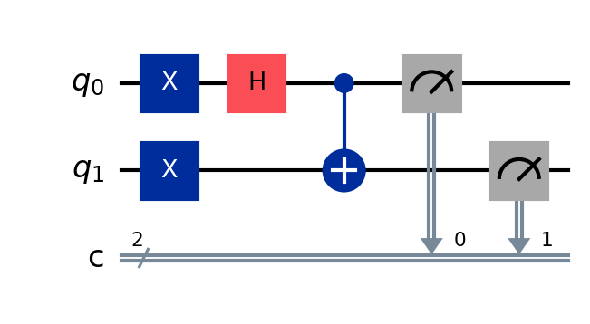

# Bell States

> The four maximally entangled two-qubit states — the simplest demonstration that two qubits can be linked so tightly that neither has a value of its own, yet measuring one instantly fixes the other.

## The problem (plain language)

Can two qubits be correlated more strongly than any two classical objects? Bell states are the "hello world" of entanglement. They show two qubits behaving as a single linked system: before measurement neither qubit has a definite value, but the moment you measure one, the other's outcome is locked in.

There are exactly four of them, and together they form a complete alternative description of two qubits — the **Bell basis**.

## The key idea

Every Bell state comes from the *same* two-gate entangler, which this project isolates in one reusable helper (`apply_shared_entangler`):

1. A **Hadamard** on qubit 0 puts it into an equal superposition of 0 and 1.
2. A **CNOT** links qubit 1 to qubit 0.

`create_bell_circuit(state_label)` then chooses which of the four states to build purely from the basis state it prepares *before* that shared entangler:

| Label | Prep before the entangler | Bell state | Form | What you measure |
|-------|---------------------------|-----------|------|------------------|
| `phi_plus`  | (nothing)           | Φ⁺ | (\|00⟩ + \|11⟩)/√2 | 00 or 11 |
| `phi_minus` | X on qubit 0        | Φ⁻ | (\|00⟩ − \|11⟩)/√2 | 00 or 11 |
| `psi_plus`  | X on qubit 1        | Ψ⁺ | (\|01⟩ + \|10⟩)/√2 | 01 or 10 |
| `psi_minus` | X on qubits 0 and 1 | Ψ⁻ | (\|01⟩ − \|10⟩)/√2 | 01 or 10 |

One entangler, four inputs, four entangled states.

## The circuit



The Hadamard creates the superposition on qubit 0; the CNOT copies that uncertainty onto qubit 1, binding the two together so they can no longer be described independently.

## Run it

```bash
pip install -r ../../requirements.txt
jupyter notebook bell_states.ipynb
```

Running all cells builds and tests each of the four states in turn.

## What you should see

Each state is simulated on Aer with 1024 shots:

- **Φ⁺ and Φ⁻** → roughly half `00` and half `11`, with almost no `01` or `10`.
- **Ψ⁺ and Ψ⁻** → roughly half `01` and half `10`, with almost no `00` or `11`.

The real evidence of entanglement is **not** the 50/50 split — it's that the "forbidden" outcomes are essentially zero. The two qubits never disagree (Φ) or always disagree (Ψ).

**A subtlety this project makes visible:** Φ⁺ and Φ⁻ produce *identical* histograms. The only thing separating them is a minus sign — a relative phase — which a standard measurement cannot see. (Qiskit prints bitstrings little-endian, so qubit 0 is the rightmost character.)

## Does quantum actually help here?

Bell states are not an algorithm and provide no speedup — they're a **primitive**. They're the building block that teleportation, superdense coding, and other entanglement protocols are made from, and the object that CHSH later uses to *prove* these correlations can't come from any classical model. This folder is a foundation, not a performance claim.

## How correctness is verified

Two layers, matching the notebook:

1. **Distribution** — for all four states, the measured counts land on the expected pair and the forbidden outcomes sit at ≈ 0.
2. **Q-sphere (phase)** — each circuit is re-run with measurements removed and the statevector is plotted with `plot_state_qsphere`. The Q-sphere colors each basis-state blob by its phase, so Φ⁺ and Φ⁻ — which give identical histograms — appear as *different colors*. That's how the otherwise-invisible minus sign is confirmed.