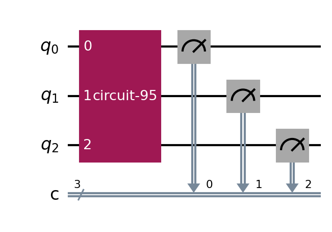
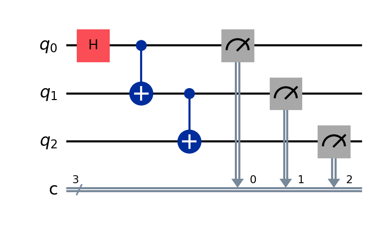

# GHZ States

> Entanglement stretched across N qubits: (\|00…0⟩ + \|11…1⟩)/√2. Every qubit agrees at once — and unlike a Bell pair, this one has no "two correlated coins" story that survives.

## The problem (plain language)

A Bell state links two qubits. What happens when you link three, or ten? The GHZ state (Greenberger–Horne–Zeilinger) is the natural generalization: an N-qubit state that is either all-zeros or all-ones, with nothing in between. Measuring any single qubit instantly determines *every* other qubit.

This is more than "extra entanglement." With three or more qubits, the correlations become impossible to explain with any classical, local picture — and you can demonstrate it in a single measurement setup rather than by averaging over many runs. That all-or-nothing quality is what makes GHZ famous.

## The key idea

`build_GHZ_circuit(n)` builds the state for any number of qubits using the Bell entangler, extended:

1. A **Hadamard** on qubit 0 creates a superposition of all-0 and all-1.
2. A **chain of CNOTs** (qubit 0→1, 1→2, 2→3, …) hands that superposition down the line until every qubit is bound to the first.

For three qubits this gives (\|000⟩ + \|111⟩)/√2. For N qubits it's one Hadamard and N−1 CNOTs — the circuit scales linearly with qubit count.

## The circuit

   Used Qiskit Append function
 Used Qiskit Compose function

The Hadamard seeds the superposition; each CNOT propagates the all-or-nothing agreement to the next qubit in the chain.

## Run it

```bash
pip install -r ../../requirements.txt
jupyter notebook ghz_states.ipynb
```

The notebook prompts for the number of qubits, then builds, measures, and verifies a GHZ state of that size.

## What you should see

Simulated on Aer with 1024 shots (e.g. for 3 qubits):

- Roughly half `000` and half `111`.
- Every other outcome (`001`, `010`, `101`, …) sits at ≈ 0.

As with Bell states, the evidence of entanglement is the *absence* of the in-between outcomes, not the 50/50 split. All qubits rise and fall together.

## Does quantum actually help here?

Like Bell states, a GHZ state is a **resource, not an algorithm** — no standalone speedup. But it's a useful resource: it underpins quantum error-correcting codes, quantum secret sharing, and Heisenberg-limited sensing in metrology. Honest framing: this folder earns its place as a foundation and building block, not a benchmark win.

One trade-off worth stating plainly: GHZ entanglement is **fragile**. Lose or measure a single qubit and the whole state collapses to a classical mixture. (The W state, a different multi-qubit entangled state, survives this — a useful contrast if an interviewer probes.)

## How correctness is verified

Two layers, matching the notebook:

1. **Distribution** — only the all-0 and all-1 strings appear (~50/50); every mixed outcome sits at ≈ 0.
2. **Q-sphere (phase)** — the circuit is rebuilt without measurement, the statevector is printed, and `plot_state_qsphere` confirms the two equal-amplitude all-0 / all-1 components and their relative phase.
