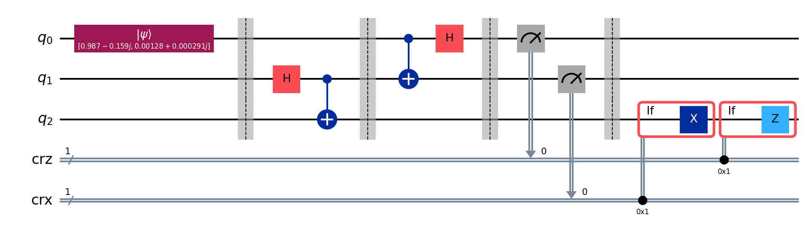

# Quantum Teleportation

> Moving an unknown qubit state from one qubit to another using a shared entangled pair and two classical bits. The original is destroyed, and nothing physical travels — only the information.

## The problem (plain language)

Alice has a qubit in some unknown state |ψ⟩ and wants Bob to hold that exact state. She can't measure it (measuring destroys it) and she can't copy it (the no-cloning theorem forbids it). Teleportation is the workaround: with a pre-shared entangled pair plus **two classical bits** sent over an ordinary channel, Bob's qubit becomes |ψ⟩ — while Alice's original is consumed in the process.

## The key idea

Three qubits: `q0` is the message, `q1`+`q2` are a shared Bell pair (Alice keeps q1, Bob keeps q2).

1. Prepare the unknown state psi on q0. Here it's a *generic* state, `psi: [0.987-0.159j 0.001+0.j ]` — deliberately chosen so it has both unequal amplitudes and a relative phase.
2. Entangle q1 and q2 (`create_bell_pair`: H + CNOT).
3. **Alice's Bell measurement** — `CNOT(q0→q1)`, `H(q0)`, then measure both. This entangles the message into the pair and collapses it into two classical bits.
4. **Bob's correction** — conditioned on those two bits, applied per-shot with `if_test`:
   - `X` on q2 if Alice's q1 bit is 1
   - `Z` on q2 if Alice's q0 bit is 1

   After the correction, q2 is in the original state |ψ⟩.

The `if_test` blocks matter: they record a *per-shot conditional* into the circuit (evaluated after measurement), which is the classical feed-forward the protocol depends on — not a build-time decision.

## The circuit



Prepare the message, entangle the pair, Bell-measure on Alice's side, then correct on Bob's side using her two classical bits.

## Run it

```bash
pip install -r ../../requirements.txt
jupyter notebook quantum_teleportation.ipynb
```

## What you should see

Alice's two measurement bits come out random — all four combinations appear across the shots. But Bob's verification bit is `0` on **100% of shots** (8192 / 8192). That deterministic `0` is the proof the state arrived intact regardless of Alice's random outcome.

## Does quantum actually help here?

No speedup, and three things it is *not*, all worth stating plainly:

- **Not faster-than-light.** Bob's qubit is a useless random mixture until Alice's two classical bits arrive over a light-speed channel.
- **Not cloning.** Alice's original is destroyed by her measurement, so two copies never coexist.
- **Not an algorithm.** It's a primitive — the backbone of quantum networks, quantum repeaters, and measurement-based computation.

Its value is as infrastructure for moving quantum information, not as a performance win.

## How correctness is verified

The state is prepared as |ψ⟩ = U|0⟩ with `U = RZ(φ)·RY(θ)`. If teleportation succeeds, Bob's q2 holds U|0⟩, so applying **U†** (`RZ(−φ)` then `RY(−θ)`) and measuring must return `0`.

The test state is chosen for rigor: it's an eigenstate of neither X nor Z, so it exercises the X correction, the Z correction, and phase-preservation all at once. A basis state or |±⟩ could pass with one correction silently broken — this one can't. Result: `0` on every shot.