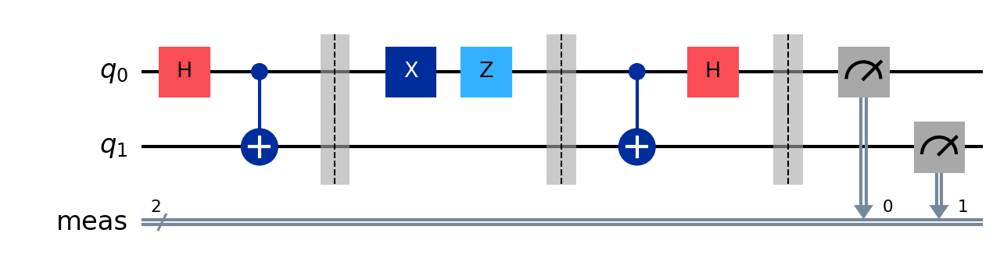
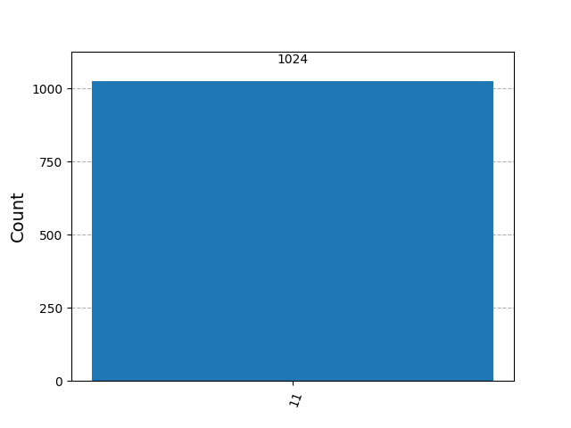
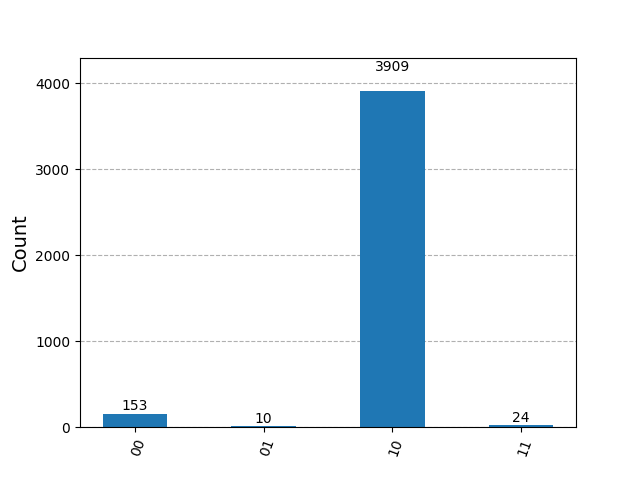

# Superdense Coding
Superdense coding is a quantum communication protocol that allows two parties, Alice and Bob, to transmit two classical bits of information using only one qubit, provided they share an entangled pair of qubits beforehand. This protocol demonstrates the power of quantum entanglement in enhancing communication efficiency.
## The problem
Alice wants to send two classical bits of information (00, 01, 10, or 11) to Bob. However, she can only send one qubit directly to Bob. The question is: can Alice encode her two bits into a single qubit and still allow Bob to decode the original two bits correctly using the shared entangled pair?
## The key idea
1. **Shared entanglement** — Alice and Bob each hold one qubit of a Bell pair (|00⟩ + |11⟩)/√2, created before the protocol starts.
2. **Alice's encoding** — Depending on the two classical bits she wants to send, Alice applies one of four operations (I, X, Z, or XZ) to her half of the entangled pair. This encodes the two bits into the state of the qubit.
3. **Bob's decoding** — Bob performs a specific set of operations (CNOT followed by a Hadamard) on his qubit and the received qubit from Alice, then measures both qubits. The measurement outcomes correspond to the original two bits Alice intended to send.
## The circuit

Reading left to right:
| Stage | What happens |
|-------|-------------|
| **Initialize** | `q0` and `q1` are initialized in the state rando.choise(['00', '01', '10', '11']) |
| **Bell pair** | H on `q0` + CNOT(`q0`→`q1`) creates the shared entangled pair. `q0` stays with Alice, `q1` goes to Bob. |
| **Alice's encoding** | Depending on the message, Alice applies I, X, Z, or XZ to `q0`. |
| **Bob's decoding** | CNOT(`q0`→`q1`) then H on `q0` — decodes the message. |
| **Measurement** | Bob measures both qubits to retrieve the original two bits. |
## Run it
```bash
pip install -r ../../requirements.txt
jupyter notebook superdense_coding.ipynb
```
## What you should see
**Measurement results:** The measurement outcomes should correspond to the original two bits Alice intended to send, with high probability (ideally 100% in a noise-free simulation). For example, if Alice encodes '10', Bob's measurement should yield '10' as well.
**Alice's message histogram (1024 shots):**
if Alice sends '00', the histogram should show a high count for '00' and low counts for '01', '10', and '11'. Similarly, if Alice sends '01', the histogram should show a high count for '01', and so on for '10' and '11'.

## Result show in a histogram:
I check results on both a simulator and real hardware. The histogram from the simulator should show a clear peak at the correct outcome corresponding to Alice's message, while the histogram from real hardware may show some noise, but the correct outcome should still be the most frequent result
#### simulator measurement count result


#### Real Hardware measurement count result


# Does quantum actually help here?
Superdense coding allows Alice to transmit two classical bits of information using only one qubit, which is impossible in classical communication. This demonstrates a clear advantage of quantum communication protocols over classical ones, as it effectively doubles the capacity of the communication channel when entanglement is utilized.
