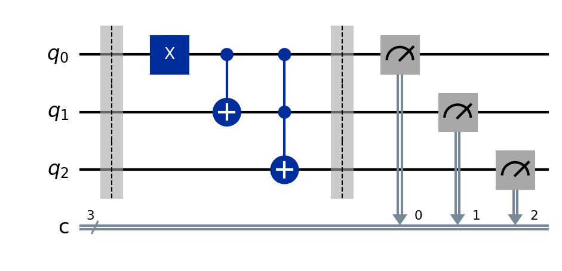

# Quantum Decrement Circuit

A quantum decrement circuit performs the operation of subtracting `1` from an `n`-qubit binary number. Because quantum computation is reversible, the circuit must be constructed using reversible logic gates that preserve information while implementing binary subtraction.

This circuit behaves like a classical binary counter in reverse, with wrap-around behavior modulo (2^n).

## The problem

Given an `n`-qubit register representing a binary number, we want to compute:

[
\text{Output} = (\text{Input} - 1) \bmod 2^n
]

Examples:

* `|000⟩ → |111⟩`
* `|001⟩ → |000⟩`
* `|010⟩ → |001⟩`
* `|011⟩ → |010⟩`
* `|100⟩ → |011⟩`

The circuit should wrap around when reaching `0`.

## The key idea

1. **Initialize the input state** — The qubits are prepared in a user-defined binary state such as `0000`, `0101`, or `1111`.

2. **Reverse increment logic** — Decrement is implemented by reversing the structure of a quantum increment circuit.

3. **Borrow propagation** — Instead of carries (as in increment), decrement uses borrow propagation through multi-controlled operations.

4. **Wrap-around behavior** — If the input is `000...0`, the output becomes `111...1`.

## The circuit



Reading left to right:

| Stage                   | What happens                                                             |
| ----------------------- | ------------------------------------------------------------------------ |
| **Initialize**          | `q0...qn` are initialized with a user-provided binary value              |
| **Borrow propagation**  | Multi-controlled gates propagate borrow logic across higher-order qubits |
| **Decrement operation** | The circuit effectively subtracts `1` in a reversible manner             |
| **Measurement**         | All qubits are measured to retrieve the decremented value                |

## Run it

```bash
pip install -r ../../requirements.txt
jupyter notebook decrement_circuit.ipynb
```

## What you should see

**Measurement results:**
The output should equal the input value minus `1` (modulo (2^n)).

### Example results

Input:

```
0100
```

Output:

```
0011
```

---

Input:

```
0000
```

Output:

```
1111
```

---

Input:

```
1111
```

Output:

```
1110
```

## Result shown in a histogram

For each input state, the simulator should produce a sharp peak at the correct decremented value. On real quantum hardware, small noise may appear, but the correct output should remain the most frequent result.

#### Simulator measurement count result


#### Real Hardware measurement count result


## Does quantum actually help here?

A quantum decrement circuit does not provide a computational speed advantage over classical subtraction, since classical computers can perform decrement operations extremely efficiently.

However, like increment circuits, it is an important reversible building block used in:

* Quantum arithmetic circuits
* Quantum random walks
* Quantum phase estimation
* Modular arithmetic in Shor’s algorithm
* Reversible logic design

The main value is not speed, but **reversible computation**, which is required in quantum computing.
