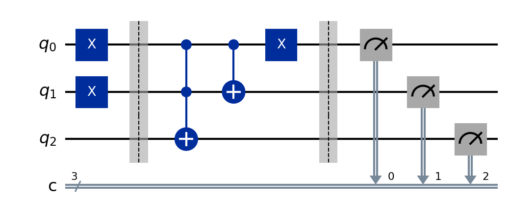

# Quantum Increment Circuit

A quantum increment circuit performs the operation of adding `1` to an `n`-qubit binary number. The circuit behaves like a classical binary incrementer but is implemented using quantum gates and reversible logic. Since quantum circuits must preserve information, carry propagation is handled through controlled operations instead of ordinary classical logic.

## The problem

Given an `n`-qubit quantum register representing a binary number, we want to increment its value by `1`.

Examples:

* `|000⟩ → |001⟩`
* `|001⟩ → |010⟩`
* `|010⟩ → |011⟩`
* `|011⟩ → |100⟩`
* `|100⟩ → |101⟩`
* `|101⟩ → |110⟩`
* `|110⟩ → |111⟩`
* `|111⟩ → |000⟩`

The circuit should wrap around automatically after reaching the maximum value. This creates a modulo `2ⁿ` increment operation.

## The key idea

1. **Initialize the input state** — The qubits are prepared in a binary state entered by the user such as `0000`, `0101`, or `1111`.

2. **Add one to the least significant bit** — The lowest-order qubit is flipped using an `X` gate, equivalent to adding `1`.

3. **Carry propagation** — If a qubit already contains `1`, a carry must propagate to the next higher-order qubit. Multi-controlled operations handle this behavior.

4. **Modulo operation** — If the input reaches the largest possible binary value (`111...111`), the output wraps around to `000...000`.

## The circuit



Reading left to right:

| Stage                   | What happens                                                              |
| ----------------------- | ------------------------------------------------------------------------- |
| **Initialize**          | `q0...qn` are initialized with a user-provided binary value               |
| **Carry propagation**   | Multi-controlled operations propagate carries through higher-order qubits |
| **Increment operation** | An `X` gate flips the least significant bit to add `1`                    |
| **Measurement**         | All qubits are measured to retrieve the incremented binary value          |

## Run it

```bash
pip install -r ../../requirements.txt
jupyter notebook increment_circuit.ipynb
```

## What you should see

**Measurement results:**
The measured output should equal the input value plus `1`.

Examples:

Input:

```text
0000
```

Output:

```text
0001
```

Input:

```text
0100
```

Output:

```text
0101
```

Input:

```text
1111
```

Output:

```text
0000
```

The output should always match:

```text
Output = (Input + 1) mod 2ⁿ
```

**Increment histogram (1024 shots):**

For a given input state, the histogram should show a dominant peak at the incremented output state.

For example:

If input is:

```text
0011
```

the histogram should show a high count for:

```text
0100
```

and very low counts for all other states.

## Result shown in a histogram:

I checked results on both a simulator and real hardware. The simulator should produce a very sharp peak at the expected incremented value. Real quantum hardware may introduce noise and small errors, but the correct output should remain the most frequent measurement result.

#### Simulator measurement count result


#### Real Hardware measurement count result


# Does quantum actually help here?

A quantum increment circuit by itself does not provide a direct computational advantage over a classical increment operation because classical computers can increment numbers very efficiently.

However, increment operations are important building blocks in larger quantum algorithms. They are commonly used in:

* Quantum arithmetic circuits
* Quantum adders
* Quantum phase estimation
* Shor's algorithm
* Quantum modular arithmetic

While incrementing a number is simple classically, constructing it using reversible quantum gates is essential because quantum computation cannot discard information like classical logic circuits can.
