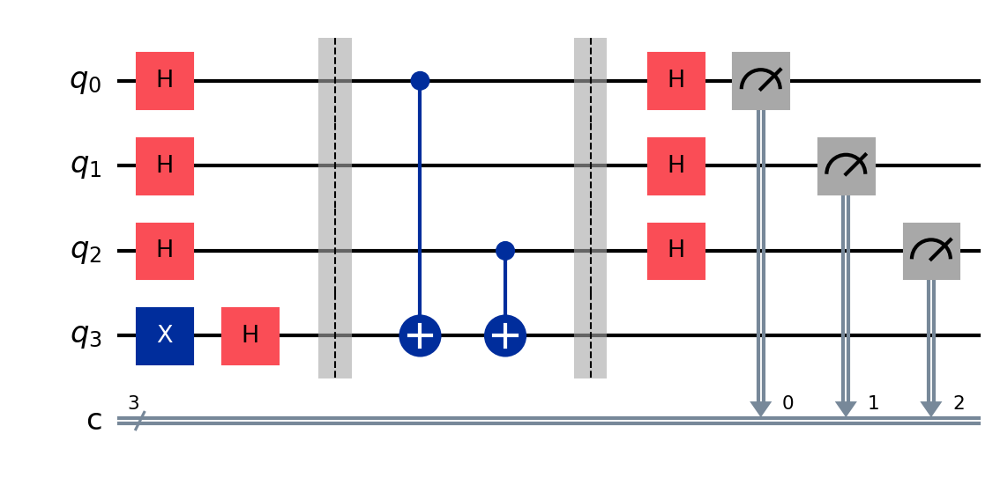

# Bernstein–Vazirani Algorithm (Quantum Circuit)

The Bernstein–Vazirani (BV) algorithm is a quantum algorithm that efficiently finds a hidden binary string using a single query to a quantum oracle. It demonstrates an exponential reduction in query complexity compared to classical methods.

---

## The problem

We are given a hidden binary string:

[
a = a_0 a_1 a_2 \dots a_{n-1}
]

We define a function:

[
f(x) = a \cdot x \ (\text{mod } 2)
]

where:

* (x) is an (n)-bit input string
* (a \cdot x) is the bitwise dot product modulo 2

### Goal:

Find the hidden string (a) using as few queries as possible.

---

## Classical vs Quantum

### Classical approach:

To determine all bits of (a), we need:

[
n \text{ queries}
]

### Quantum approach (BV algorithm):

We need:

[
1 \text{ query}
]

---

## The key idea

The BV algorithm uses **quantum superposition and phase kickback**:

1. **Initialize qubits**

   * Input qubits start in (|0\rangle)
   * Ancilla qubit starts in (|1\rangle)

2. **Create superposition**

   * Apply Hadamard gates to all qubits

3. **Oracle encoding**

   * The oracle encodes the hidden string (a) using CNOT gates:
     [
     |x\rangle|y\rangle \rightarrow |x\rangle|y \oplus (a \cdot x)\rangle
     ]

4. **Interference**

   * Hadamard gates are applied again on input qubits

5. **Measurement**

   * The hidden string is revealed directly

---

## The circuit



### Circuit flow:

| Stage                 | Description                                    |                       |    |
| --------------------- | ---------------------------------------------- | --------------------- | -- |
| **Initialize**        | Input qubits are set to                        | 0⟩, ancilla is set to | 1⟩ |
| **Superposition**     | Hadamard gates applied to all qubits           |                       |    |
| **Oracle Uf**         | Encodes hidden string using controlled-X gates |                       |    |
| **Interference step** | Hadamard gates applied to input qubits         |                       |    |
| **Measurement**       | Input qubits are measured                      |                       |    |

---

## Oracle construction

The hidden string is embedded using:

```python id="bv_oracle"
secret = secret[::-1]  # little-endian conversion

for i in range(n):
    if secret[i] == '1':
        circuit.cx(i, ancilla)
```

Each `1` in the secret string applies a CNOT gate, encoding the hidden bit pattern into phase information.

---

## Run it

```bash id="runbv1"
pip install qiskit qiskit-aer qiskit-ibm-runtime
jupyter notebook bernstein_vazirani.ipynb
```

---

## Example execution

Input:

```text id="inbv1"
n = 4
secret = 1011
```

After converting to little-endian:

```text id="inbv2"
secret = 1101
```

---

## Expected result

Measurement output:

```text id="outbv1"
1011
```

with probability ≈ 100%

---

## Result interpretation

The output bitstring directly represents the hidden function:

* Each bit corresponds to one element of the secret string
* No probabilistic guessing is required

---

## Why this works

The BV algorithm uses:

* **Quantum superposition** → evaluates all inputs at once
* **Phase kickback** → encodes hidden string into phase
* **Hadamard transform** → extracts hidden information

This allows the full string to be recovered in a single oracle call.

---

## Does quantum help here?

Yes — but in a theoretical sense.

BV demonstrates:

* Exponential reduction in query complexity (n → 1)
* Power of interference in extracting global structure
* Importance of reversible oracle design

However, like Deutsch–Jozsa, BV is primarily a **proof-of-concept algorithm**, not a direct industrial application.

---

## Key takeaway

The Bernstein–Vazirani algorithm shows that:

> A hidden structured function can be completely learned with only one quantum query, while classical methods require multiple queries.
