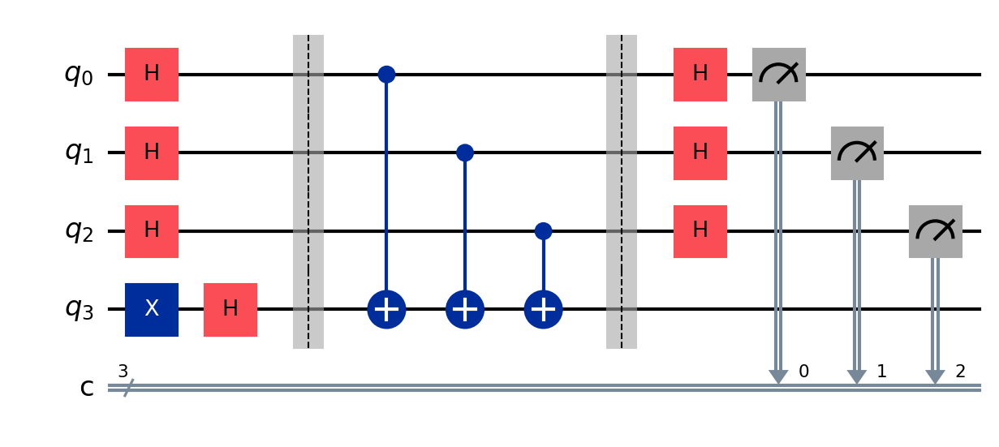

# Deutsch–Jozsa Algorithm (Quantum Circuit)

The Deutsch–Jozsa (DJ) algorithm is one of the earliest quantum algorithms that demonstrates a clear separation between classical and quantum computation. It determines whether a given Boolean function is **constant** or **balanced** using only one query to the oracle.

## The problem

We are given a function:

[
f(x): {0,1}^n \rightarrow {0,1}
]

We are promised that the function is either:

* **Constant** → outputs the same value for all inputs
  (all 0 or all 1)

* **Balanced** → outputs 0 for exactly half of all inputs and 1 for the other half

### Goal:

Determine whether the function is **constant or balanced** using the fewest queries possible.

Classically, in the worst case, you need:

[
2^{n-1} + 1 \text{ evaluations}
]

Quantumly, you only need:

[
1 \text{ query}
]

---

## The key idea

The DJ algorithm uses **quantum parallelism and interference**:

1. **Superposition of inputs**

   * All input states are created simultaneously using Hadamard gates.

2. **Oracle evaluation**

   * A quantum oracle (U_f) encodes the function:
     [
     |x⟩|y⟩ \rightarrow |x⟩|y \oplus f(x)⟩
     ]

3. **Interference**

   * Hadamard transforms are applied again to cancel or amplify amplitudes.

4. **Measurement**

   * Final measurement reveals whether the function is constant or balanced.

---

## The circuit



### Circuit flow:

| Stage                 | Description                                 |                                    |    |
| --------------------- | ------------------------------------------- | ---------------------------------- | -- |
| **Initialize**        | `n` input qubits are set to                 | 0⟩ and one ancilla qubit is set to | 1⟩ |
| **Superposition**     | Apply Hadamard gates to all qubits          |                                    |    |
| **Oracle Uf**         | Encodes the function (constant or balanced) |                                    |    |
| **Interference step** | Hadamard gates applied to input qubits      |                                    |    |
| **Measurement**       | Only input qubits are measured              |                                    |    |

---

## Oracle types

### 1. Constant Oracle

The function returns the same value for all inputs.

Example:

* ( f(x) = 0 ) → do nothing
* ( f(x) = 1 ) → flip ancilla qubit

---

### 2. Balanced Oracle

Half of the inputs flip the ancilla qubit.

Example implementation:

```python
for i in range(n):
    circuit.cx(i, ancilla)
```

---

## Run it

```bash
pip install qiskit qiskit-aer qiskit-ibm-runtime
jupyter notebook dj_algorithm.ipynb
```

---

## Expected results

### Constant function

Measurement result should always be:

```text
000...0
```

with probability ≈ 100%

---

### Balanced function

Measurement result will **never** be all zeros:

```text
any state except 000...0
```

Example outputs:

* `101`
* `011`
* `110`

---

## Decision rule

After measurement:

* If result is `000...0` → **Function is CONSTANT**
* Otherwise → **Function is BALANCED**

---

## Why this works

The algorithm uses **quantum interference**:

* Constant function → constructive interference at `|000...0⟩`
* Balanced function → destructive interference cancels `|000...0⟩`

This allows a single query to the oracle to solve a problem that is exponentially hard classically.

---


Deutsch–Jozsa is important because it shows:

* Quantum systems can evaluate all inputs simultaneously
* Interference can extract global properties of functions
* Exponential query advantage over classical deterministic methods

However, in practical applications, DJ is mostly a **proof-of-concept algorithm**, not a real-world speedup tool.
